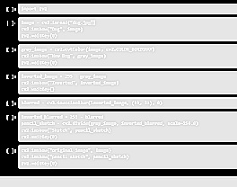
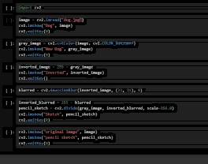

# 🖼️ Sketch Toggle App

A Python OpenCV app to toggle between grayscale and colored pencil sketch effects, with live sliders for blur and contrast adjustment.

## 🔧 Features

- ✏️ Grayscale pencil sketch (adjust contrast + blur)
- 🎨 Colored pencil sketch (stylized with edge detection)
- 🔁 Toggle between modes in real time
- 💾 Press `S` to save, `ESC` to exit

## 🖼️ Preview

### Grayscale Sketch


### Colored Sketch


## 🚀 Usage

1. Install OpenCV:
```bash
pip install opencv-python
```

2. Run the app:
```bash
python sketch_toggle_app.py
```

3. Adjust the sliders and press:
- `S` to save output
- `ESC` to exit

## 📁 Files

- `sketch_toggle_app.py` - Main Python script
- `gray_sketch_preview.jpg` - Sample grayscale output
- `color_sketch_preview.jpg` - Sample colored output

## 📄 License

MIT License